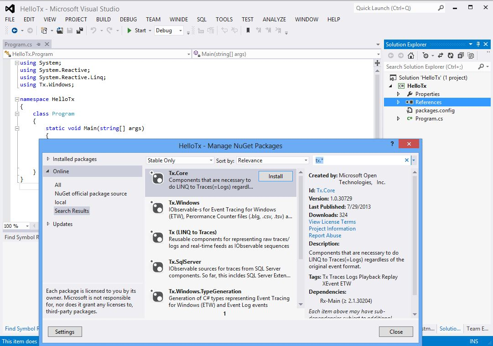
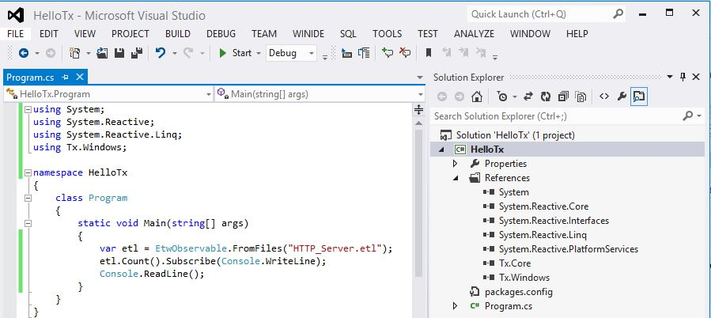

# Hello Tx

Building console app that counts the events in .etl (Event Trace Log) file

* In Visual Studio, create new console project
* Remove all other references except System
* Click References->Manage NuGet  Packages
* Search for Tx.*:

Let's install Tx.Windows, an then type the following code:

To run this program, you have to download [HTTP_Server.etl](..\Traces\HTTP_Server.etl) into bin\Debug
