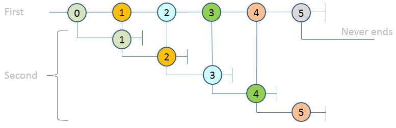
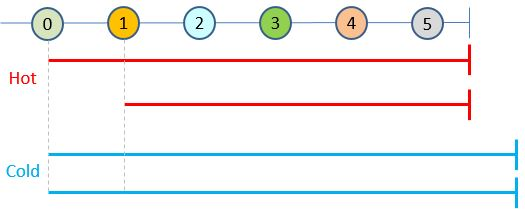

# All observables in Tx are "Hot"

Design goal of Tx is to achieve the same experience of "query on events" that works the same way on past event records (logs, traces) and real-time event feeds. 

## Hot vs. Cold differences

Rx introduces two types of Observables:

* **Hot**, in which the subscriber gets only events occurring after the subscription
  * Example is mouse move events
* **Cold**, in which the subscriber gets all events from the beginning
  * Example is doing .ToObservable on unchanging array of values (IEnumerable)

Both definitions are useful in many real-world situations, but there is a subtle difference how queries work. 

### Hot observables work as per the marble diagrams

Let's start with trivial implementation of Hot observable:

    class HotObservable : IObservable<int>
    {
        Subject<int> _subject = new Subject<int>();

        public void Run()
        {
            for(int i=0; i<5; i++) _subject.OnNext(i);

            _subject.OnCompleted();
        }

        public IDisposable Subscribe(IObserver<int> observer)
        {
            return _subject.Subscribe(observer);
        }
    }
And do a simple query that relies on order: 

    var o = new HotObservable();

    var pairs =
        from f in o
        from n in o.Take(1)
        select new { First = f, Next = n };

    pairs.Subscribe(Console.WriteLine);
    o.Run();
 

The output is:

    { First = 0, Next = 1 }
    { First = 1, Next = 2 }
    { First = 2, Next = 3 }
    { First = 3, Next = 4 }

This is matching the expectation from the marble diagram:

Here:

* As each event occurs, it starts a new observable watching for one event
* Under the covers, this means new subscription on the same sequence. Because the observable is Hot it gets only the events occurring after the subscription, and takes the first one
* Colors represent matching events

### Cold observables paradox

Now let's try the same query with Cold observable:

    var data = new int[] { 0, 1, 2, 3, 4 };
    var o = data.ToObservable();

    var pairs =
        from f in o
        from n in o.Take(1)
        select new { First = f, Next = n };

    pairs.Subscribe(Console.WriteLine);

The output is:

    { First = 0, Next = 0 }
    { First = 1, Next = 0 }
    { First = 2, Next = 0 }
    { First = 3, Next = 0 }
    { First = 4, Next = 0 }

This result is exactly the same as LINQ to Objects on the original data as IEnumerable collection:

    var data = new int[] { 0, 1, 2, 3, 4 };
    var pairs =
        from f in data
        from n in data.Take(1)
        select new { First = f, Next = n };

    foreach (var p in pairs) Console.WriteLine(p);

Unfortunately, it is not easy to think about it as a marble diagram - it would look like arrows return back in time to start from 0. 

The reason for this paradox is that:

* in case of Hot observables, there was single **order** that applied to both events and subscriptions - occurrence order as of physical time. 
* In case of Cold observables, there are **two independent concepts of order**:
	* Order of events in the set (variable "data")
	* Order of subscriptions (physical time)

This is a picture of the set semantics which events belong to which observables

Here:

* in case of Hot observables, the n (next) observable starts from the moment f (first) event occurs
* in case of Cold observables n is always the entire collection (starts from 0)

Supporting Cold observables or plain IEnumerable-s are bad idea for two reasons.

## Other issues with Cold observables

### "Cold" mode requires all events to be stored  

In typical Rx usage, there is no assumption that events are stored. Most of the Rx applications are about responsive UI - dealing with live sources like mouse moves etc. To help deal with exorbitant event volumes, Rx provides primitives like Sample and Throttle.

Supporting Cold observables on the other hand requires that the events are stored. This works for files but not in real-time, unless we add extra latency and use lots of RAM.

### Multiple reads of large file(s)

Let's consider example of Join query on IIS traces:

	var requests = from b in begin 
			   from e in end.Where(e=>e.Header.ActivityId == b.Header.ActivityId).Take(1)
			   select new
			   {
					b.Url,
					e.HttpStatus,
					Duration = (e.Header.Timestamp - b.Header.Timestamp).TotalMilliseconds
				};
 
If "begin" and "end" were small in-memory collections this query could be done using LINQ to Objects. But if they refer to the same trace (say, 1TB etl file on disk):

* from...from pattern expands as SelectMany
* this means nested loops (N square cost)

Cold observables are the dual of IEnumerable and suffer all the same problems. What would happen in this query is:

* Each time begin event occurs, it will create a new observable waiting for end event (see the marble diagram above)
* This would trigger another read of the file
	* Since the file does not fit in memory, it means disk IO
* The correlation rule about ActivityId and Take(1) would help to interrupt the read
	* Finding matching end event will get slower as the file grows since each time we read from the beginning

In short:

* IEnumerable in .Net was only intended for collections, in which the data is small enough to fit in RAM. 
* It works ok on small files
* After this, one should implement IQueryable to some system that is smart enough not to do nested loops (e.g. uses indexes or merge-join like SQL Server)

## Tx simplification

With Tx, we want to enable users to do "query on events": 

* On **raw logs/traces** without parsing them to database or uploading them into some other storage
* On real-time feeds (**nothing hits disk**). 

To do this, we need a programming model for "query on events" that is symmetrical about past (logs/traces) and real-time. 

This allows users to:

* Practice queries on past events (as if a the traces/logs were a database)
* Turn some queries into real-time without any modification

Assuming **single, typed** input sequence the cold observable paradox can be avoided by turning the to hot:

	var data = new int[] { 0, 1, 2, 3, 4 };
    var o = data.ToObservable().Publish();

    var pairs =
              from f in o
              from n in o.Take(1)
              select new { First = f, Next = n };

    pairs.Subscribe(Console.WriteLine);
    o.Connect(); 

Behind the scenes, Publish() uses a Subject. 

Similarly, all the observables returned from Playback.GetObservable&lt;T&gt; are hot. This is done by using Subject at the output of [Demultiplexor](../Source/Tx.Core/Demultiplexor.cs)

# See also
Detailed discussions about Hot and Cold observables:

* Wes Dyer's [presentation](http://channel9.msdn.com/Blogs/J.Van.Gogh/Rx-API-in-depth-Hot-and-Cold-observables) on Channel 9 
* [Prgramming C# 5.0](http://shop.oreilly.com/product/0636920024064.do), Chapter 11, Fundamental Interfaces, IObservable&lt;T&gt;
* [Hot and Cold observables](http://introtorx.com/Content/v1.0.10621.0/14_HotAndColdObservables.html#HotAndCold) in [IntroToRx](http://introtorx.com/)

More about Playback:

* [Playback Features](PlaybackFeatures.md)
* [Playback Conceptual Model](PlaybackConcepts.md) 

