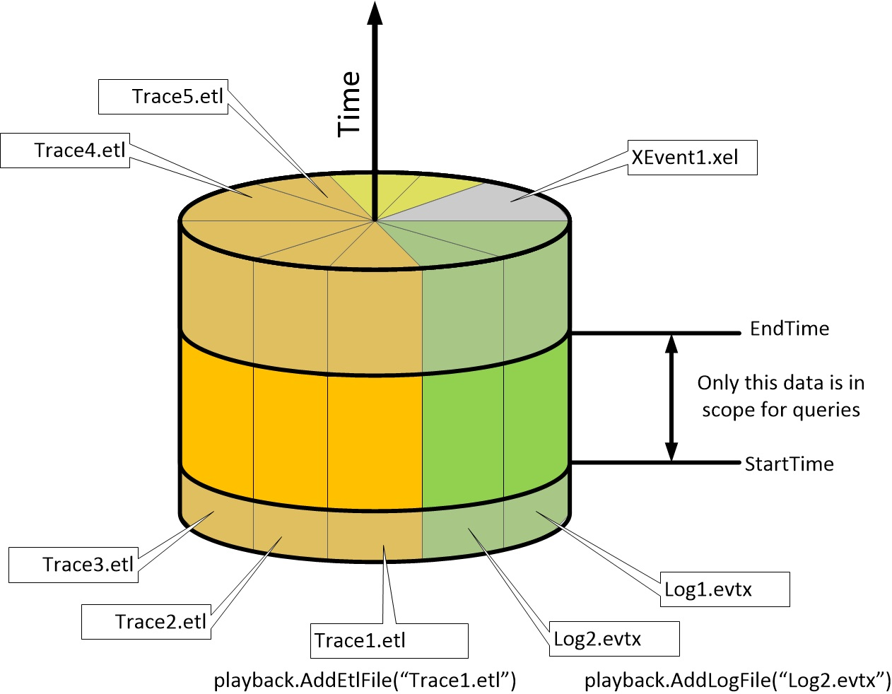
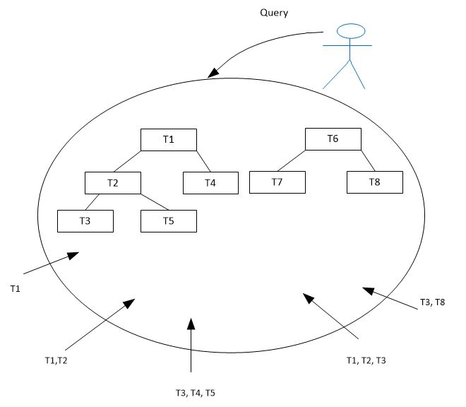
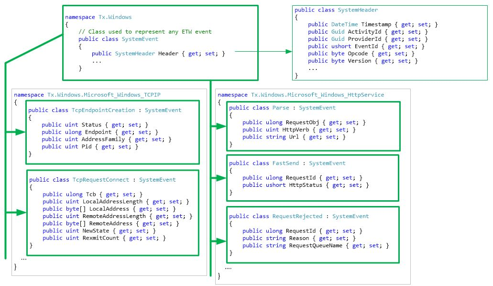
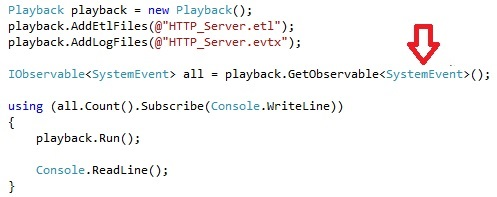
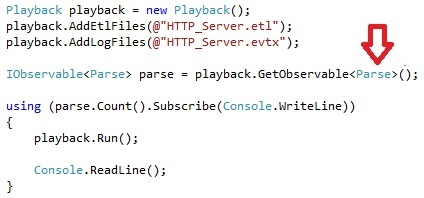

# The Playback conceptual model

The name “Playback” is intended to represent the intuition of replaying the events in order of occurrence. 

Playback is very similar to the Rx notion of TestScheduler. 
The difference is that: 

* TestScheduler lets you register events, and keeps pairs {value, time} in memory
* In Playback the events come from external sources and the volumes are unbound.

## Step 1: Adding event feeds:

In this picture:

* The user added 5 Windows traces, 2 Windows logs, 1 XEvent trace etc.
* He limited any further queries into time range StartTime…EndTime

The goal is replay the recorded history as it occurred. 
Not all the history... just between StartTime and EndTime.

## Step 2 Asking for events of fixed type(s)

The user of Playback can think of all the event types as a forest. Here the roots represents some base classes and the tree is type inheritance:

Here:

* If the user asks for T3, they will get all T3, occurrences regardless of which feed they came from. In this case the three feeds on right.
* If the user asks for T2, they get all occurrences of T2 (base class) or T3 or T5 (derived classes)
* Asking for T1 means getting all events, but being able to access them as if they contained only the T1 (base class) data.

## Example: ETW
The following picture shows specific example with ETW:

Here:

* The type SystemEvent comes out-of-box and allows you to ask for “All Events”
* The types for TCPIP and HttpService are generated from manifests

Imagine now that we have .etl trace from IIS, and we open it with EventVwr (or convert to log using tracerpt.exe). This will produce .evtx file that has the exact same events.

There is how Playback can be used to count all events in both files:

If we wanted to count just the Parse events, we can either do .Where(e=>e.Header.EventId == 2) or:

The benefit of the second approach is that we don't need to remember the Id-s, all we care about is type names.

