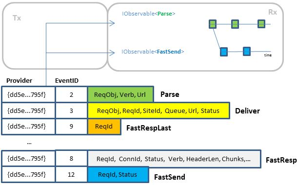
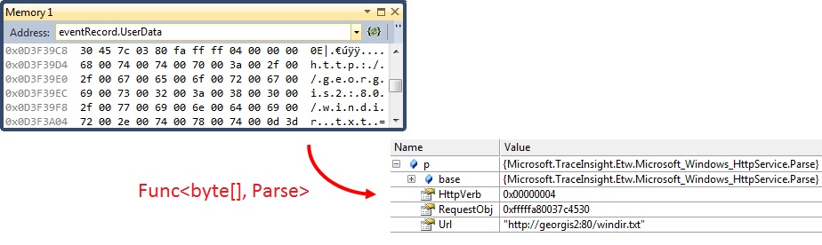

# Playback Internals

## Intuition in the simplest case

To understand how playback works, it is useful to start with the simplest case:

* Single .etl file 
* Events identified by integer Id
 

ETW preserves the order, so here we see:

* Events in the order they occurred
* So far, each event has different schema. This is single request trace, before the same EventID-s start repeating.
This is a sequence, but different than IObservable<T>, where each event is of the same type T.
The name we use in Tx is *multiplexed* sequence. 

We are now going to de-multiplex these events into IObservable-s.
In this case IObservable<Parse> and IObservable<FastSend> are shown on Rx marble diagram
Here Parse (id=2) and FastSend (id=12)  are types [generated from manifest](TypeGeneration.md). 

The ETW API is Push, so we will get the events in a [callback](http://msdn.microsoft.com/en-us/library/windows/desktop/aa363743(v=vs.85).aspx) that Tx implements. 

Let's disregard the system header and focus on user data. 

For each type of interest, we have remembered the eventID. When we see the first occurrence of this ID, we use the attributes to build Expression<Func<byte[], Parse>>, which is then compiled to Func<byte[], Parse>. 
 

The next events with ID-s 3, 9 ... 8 are of no interest so they are simply skipped.
Then the event with ID = 12 is transformed to FastSend.

In this simple case:

* we take one multiplexed stream
* produce one or more IObservable sequences, while preserving the order of callback invocations.

## Dealing with heterogeneity
Life would be easy if everyone was tracing like IIS does.

Unfortunately, there is difference between Manifest and Classic providers:

- In Manifest providers events are identified with { ProviderId, EventId, Version }. 
- In Classic providers events are identified as { EventGuid, Opcode, Version }

There are many other formats completely different from ETW

Thus the real implementation of Playback contains few more parts:

Here:

* The events from the trace will show up as binary structures, using [EtwObservable.FromFiles](../Source/Tx.Windows/EtwNative/EtwObservable.cs)
* The events from the log come from [EvtxObservable.FromLog](../Source/Tx.Windows/Evtx/EvtxObservable.cs)
* The events from the .blg file come from [PerformanceCounterObservable.FromFile](../Source/Tx.Windows/PerfCounters/PerfCounterObservable.cs)

Up to here the components mentioned are surfacing the events in their raw form. 
One can think of this as trivial cleanup of the API surface - everything is IEnumerable or IObservable.

Let's first look at the events from the etl file. 

* Some will be from Manifest based providers, identifiable by { ProviderId, EventId, Version }
* Some will be from "Classic" providers, identifiable by { EventGuid, Opcode, Version }

In both cases, we have a **partitioning key** - something we can use to ignore events that are of no interest, and apply type-specific transformations for the rest. This is the implemented by the [PartitionKeyDeserializer](../Source/Tx.Core/PartitionKeyDeserializer.cs)

The [Type Maps](../Source/Tx.Core/ITypeMap.cs) are components you can build to extend Tx:

* ITypeMap represents stream in which all events at output have the same schema
* IRootTypeMap reprensents stream in which the output events form a tree with single base class
* IPartitionableTypeMap represents pattern in which we have partition key like the manifest or classic events

The output of the transformation is then packaged in IObservable of Timestamped of object.
This way, regardless of the input types we are now dealing with observables of the same type.

These are used in merge-sort implementation that has two invariants:

* order per-source is preserved
* the different sources are merged on Timestamps, which provides (a bit noisy) illusion of global order.
This single stream represents *all events in order of occurrence*. 
It is fed into instance of [TimeSource] that has a Scheduler representing *virtual time*

Finally, the values from the merged pipeline are send into the [url:Demultiplexor | http://tx.codeplex.com/SourceControl/latest#Source/Tx.Core/Demultiplexor.cs ].
On the left, this is IObserver<object> and on right it provides the familiar interface of .GetObservable<T>()

## See also:
* [ULS Sample] Extending the Playback with semi-structured text logs
* [TimeSource] Creating virtual time