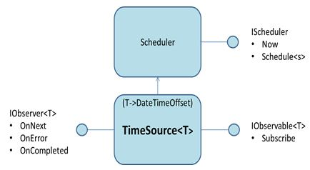

# TimeSource

In Rx 2.1 there are number of temporal operators. 
Example is Window( 5sec) that means “Take only 5 sec of events”. The typical use is aggregation – e.g. count the events in 5 sec window. 

If we don’t do anything special, this means “5 sec as per system time on the machine”. I.e. behind the scenes Rx will set a timer. 

This was ok for what Rx was originally used (asynchronous UI), but results in non-deterministic output in two important cases:

* events coming from a file
* events are delayed (buffered or send over the network)

The following picture illustrates how we introduce virtual time:

If the subsequent query does not use time, the TimeSource is almost indistinguishable from Subject.
The only difference is that it  exposes IConnectableObservable, so even if you call Subscribe events won't start flowing. 

In the case the input comes from file, this allows you to build many queries and evaluate them in *single read* (quite useful if the file is huge).

If the query contains temporal operators, you can use virtual time like this:

	static void Main()
	{
	    IObservable<EtwNativeEvent> etl = EtwObservable.FromFiles(@"HTTP_Server.etl");
	
	    var timeSource = new TimeSource<EtwNativeEvent>(etl, e => e.TimeStamp);
	
	    var countPerWindow = from window in timeSource
	            .Window(TimeSpan.FromSeconds(5), timeSource.Scheduler)
	            from Count in window.Count()
	            select Count;
	
	    var withTime = countPerWindow.Timestamp(timeSource.Scheduler);
	
	    using (withTime.Subscribe(ts => Console.WriteLine("{0} {1}", ts.Timestamp, ts.Value)))
	    {
	        timeSource.Connect();
	        Console.ReadLine();
	    }
	}

Here we used ETW just as example. 

TimeSource is generic primitive that works on any IObservable&lt;T&gt;, where T contains some data sufficient to create a timestamp.

Code:

* [Implementation](../Source/Tx.Core/TimeSource.cs)
* [Usage example](../Samples/Introduction/EtwRaw_VirtualTime/Program.cs)
