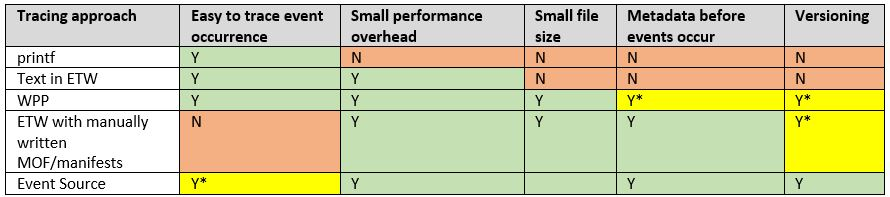

# Tracing From .Net

With Tx, we are illustrating a design pattern that can be used with any  log/trace format. We assumes the code producing traces already exists and we are not going to change it. 

Adding new log/trace format to Tx is achieved by implementing a parser . 
Still, it is worth comparing how the choice of tracing/logging technology impacts the overall application usefulness:

The chapters below summarize our learning. 
The technology you can get the most value from is EventSource

## printf

There are numerous API-s for plain text logging which are mutations of the "printf" idea in standard C. 
In C# the most notable options for text tracing are:

* System.Diagnostics.[TraceSource](http://msdn.microsoft.com/en-us/library/system.diagnostics.tracesource%28v=vs.110%29.aspx)
* [Log4Net](http://logging.apache.org/log4net/)
* Patterns & Practices [Loging and Instrumentation Application Block](https://msdn.microsoft.com/en-us/library/ff648417.aspx)
 
Regardless of API choice:

* Concatenating strings is wasting CPU and memory 
* Files are bloated by repeating format strings
* There is no way to tell ahead of time what kinds of events may occur 

In short, printf-like tracing solves the problem how easy it is for developer to produce logs/traces and creates problems for everybody else - people that manage logs/traces or try to do analyze them.  

Pieces from Tx code relevant for plain text are: 

* Support for [W3C text logs](../../Source/Tx.Windows/IIS/W3CEnumerable.cs) from IIS 
* The [extensibility sample](../../Samples/Introduction/UlsLogs/Readme.md)

## Text in ETW
One simple solution to fixing the run-time performance is to redirect the traces using [EventProviderTraceListener](http://blogs.msdn.com/b/peaceofmind/archive/2008/04/16/using-eventprovidertracelistener.aspx). 

ETW implements asynchronous buffering and disk-space pre-allocation, so compared to self-made trace-listener the run-time performance degradation can be reduced from 40 times to negligible

Unfortunately, this does not fix the other problems. Files are even bigger because each file has header block and each event has ETW header. 

Relevant Tx samples are:

* [Causality Navigation](../../Samples/TimeAndOrder/CausalityNavigation/Readme.md) for how to trace and then read it
* [IE_IIS](../../Samples/LinqPad/Queries/IE_IIS/Readme.md) for parsing sub-strings from text in ETW events

## Windows Trace Pre-Processor (WPP)

WPP originated as a way to instrument native code so that:

* The API is set of macros as easy as printf
* The formatting strings are not traced, but put in the pdb instead
* Tools like [tracefmt.exe](https://msdn.microsoft.com/en-us/library/windows/hardware/ff552974%28v=vs.85%29.aspx) and [traceview.exe](https://technet.microsoft.com/en-us/subscriptions/index/ff553892) reconstruct the traces for viewing

[NTrace](http://ntrace.codeplex.com/) looks like open source .Net implementation. 

Note WPP traces are not currently supported in Tx.

## ETW with manually written manifests

In [this approach](https://msdn.microsoft.com/en-us/library/windows/desktop/aa363668%28v=vs.85%29.aspx), manifests are manually written and then compiled to ETW proxies. Although traces are excellent to use LINQ on, it requires significant amount of work to write the manifest and complex build environment.

One other problem is the fragility as Manifests are distributed separately from the ETL files and can easily mismatch.

## Event Source

Finally the best approach is using the [EventSource API](http://blogs.msdn.com/b/vancem/archive/2012/08/13/windows-high-speed-logging-etw-in-c-net-using-system-diagnostics-tracing-eventsource.aspx) which shipped in .Net 4.5.
Additional benefits of this approach are:

* Manifests are auto-generated
	* this reduces the complexity a lot
	* it results in unique, friendly names in the symbol attribute (showing as class names in Tx)
* Manifests are included in the etl files
	* This eliminates UI steps in (no need to browse for Manifests)
	* It makes sure the right manifest is used

In Tx, files produced by EventSource have first class support:
- In the [LINQPad Driver](../../Source/Tx.LinqPad/Readme.md), you can choose just etl-s (manifests are inside)
- The type generation also works from etl files

Most new .Net technologies like [WCF in .Net 4.5](../../Samples/LinqPad/Queries/WcfTroubleshooting/Readme.md), Tasks, WebSockets, etc. are instrumented for structured tracing like this.

