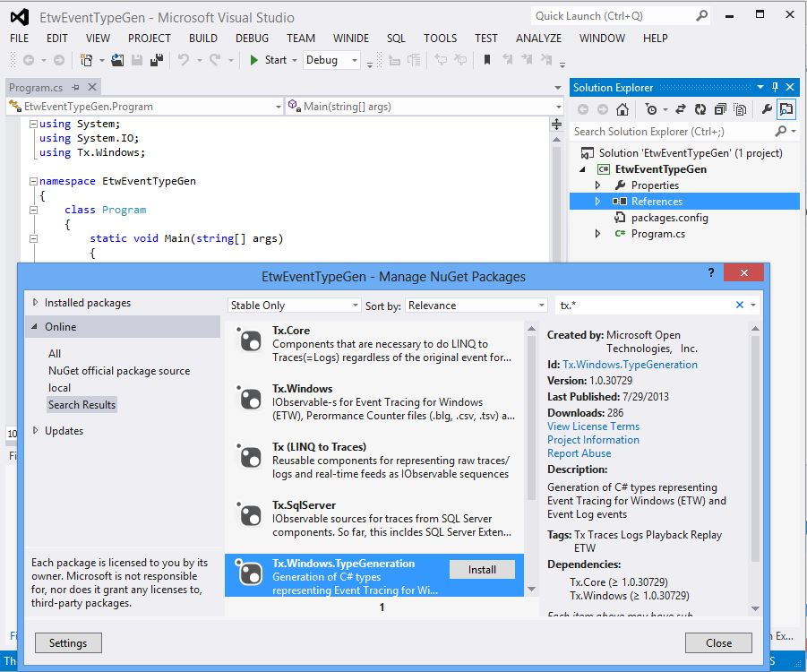
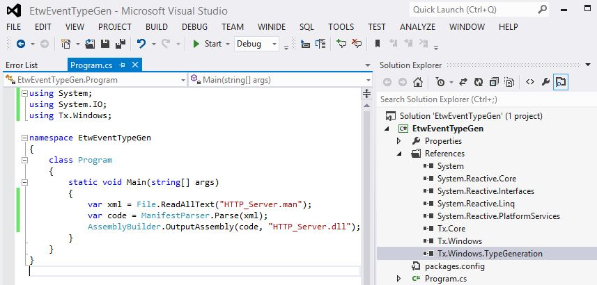

# C# Type Generation

Class generation is common technique that empowers tools like [LINQPad](http://www.linqpad.net) and [SvcPerf](http://svcperf.codeplex.com).
Here are the steps to build a simple console tool for class generation:

* In VS, create console application called EtwEventTypeGen
* Remove all references except System
* Click Add References, Manage NuGet packages
* Search for Tx.*

Install Tx.Windows.TypeGeneration

Copy [HTTP_Server.man](..\Manifests\HTTP_Server.man) to bin\Debug and type the following code:

The component [ManifestParser](../Source/Tx.Windows.TypeGeneration/ManifestParser.cs) can read:

* Self contained .etl files produced when you use [EventSource](http://blogs.msdn.com/b/vancem/archive/2012/07/09/logging-your-own-etw-events-in-c-system-diagnostics-tracing-eventsource.aspx) for tracing
* Manifests generated from assemblies like the above
* [Manually written manifests](http://msdn.microsoft.com/en-us/library/windows/desktop/dd996930(v=vs.85).aspx)
* Manifests exported with tracerpt.exe 
> example: tracerpt -export m.manHTTP_Server.etl)
* Manifests for Classic providers, exported as above (here the authoritative metadata was WMI)

Here is example of the class that gets generated for EventId = 2:

Here:

* The type system is simplified: e.g. both Unicode and ASCII strings are both mapped to "string"
* The extra mapping details are encoded in the attribute

Finally, to get more useful tool that handles command arguments you can copy the code for [EtwEventTypeGen](../Source/EtwEventTypeGen/Program.cs)

