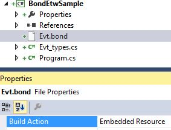

# Reading and writing Bond-In-ETW

In this sample, we assume a world in which all events are instances of  [Bond](https://github.com/Microsoft/bond) classes. The schema is defined in manifests like [Evt.bond](Evt.bond):

	struct Evt
	{
		1: required datetime Time;
		2: required string Message;
	};

Using the bond compiler (bondc.exe) manifests are used to generate C# types like [Evt_types.cs](Evt_types.cs).

## Writing

Writing produces self-contained file, that has all the manifests followed by the event occurrence records. This allows tools to use the correct manifest version as opposed to expecting the user to keep the manifest as separate file (idea inspired by [EventSource](http://blogs.msdn.com/b/vancem/archive/2012/07/09/logging-your-own-etw-events-in-c-system-diagnostics-tracing-eventsource.aspx).

To write events:

* Add reference to the Tx.Bond NuGet package
* Add "using Tx.Bond"
* Include both the manifest and the generated code in the project
* Mark the manifest as Embedded Resource:

       

* start ETW session and use instance of BondObserver:

		var observer = new BondEtwObserver(
			Type2ManifestMap(), 
			TimeSpan.FromMinutes(1));
		
		for (int i = 0; i < 10; i++)
		    observer.OnNext(new Evt { 
				Time = DateTime.UtcNow.ToShortDateString(),
				Message = "iteration " + i });
		
		observer.OnCompleted();

The result of this is self-contained bond-in-etw file:

* Manifest(s) are written once at start, and repeated every minute
* The rest are event occurrences (Bond instances)

See complete example: [Program.cs](Program.cs)

## Reading
Reading applications can use two approaches:

* Including to classes generated from the manifests at compile time
* dynamic generation from the manifests in the file 

This sample illustrates the first option:

* Add reference to the Tx.Bond NuGet package
* Add "using Tx.Bond"
* Include the generated code in the project (no need for the manifest)
* Specify files and do some query:

	    Playback playback = new Playback();
	    playback.AddBondEtlFiles(sessionName + ".etl");
	
	    playback.GetObservable<Evt>()
	        .Subscribe(e=> Console.WriteLine("{0}: {1}", e.Time, e.Message);
	
	    playback.Run(); 

See complete example: [Program.cs](Program.cs)

