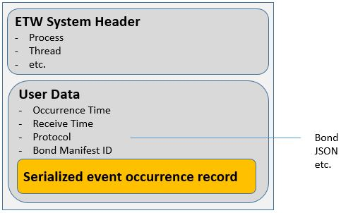

# Bond-in-ETW

All other Tx samples show how to use LINQ on existing log/trace formats, by only implementing reading, parsing and queries.

This sample illustrates something else - using  ETW as efficient mechanism to write and read events of various serialization formats in the same file.

## Writing and reading Bond via the API
In the simplest case, all events are instances of [Bond](https://github.com/Microsoft/bond) classes defined in manifests like [Evt.bond](API/Evt.bond), which are then used to generate C# types like [Evt_types.cs](API/Evt_types.cs):

	struct Evt
	{
		1: required datetime Time;
		2: required string Message;
	};

To write such events:

* Add reference to the Tx.Bond NuGet package
* Add "using Tx.Bond"
* Include both the manifest and the generated code in the project
* Mark the manifest as Embedded Resource:

       

* start ETW session and use instance of BondObserver:

		var observer = new BondEtwObserver(
			Type2ManifestMap(), 
			TimeSpan.FromMinutes(1));
		
		for (int i = 0; i < 10; i++)
		    observer.OnNext(new Evt { 
				Time = DateTime.UtcNow.ToShortDateString(),
				Message = "iteration " + i });
		
		observer.OnCompleted();

The result of this is self-contained bond-in-etw file:

* Manifest(s) are written once at start, and repeated every minute
* The rest are event occurrences (Bond instances)

Reading:

    playback.GetObservable<Evt>()
        .Subscribe(e=> Console.WriteLine("{0}: {1}", e.Time, e.Message);
 

See complete example at [API/Program.cs](API/Program.cs)

## Framing protocol

To support multiple serialization formats, the implementation uses "Framing" - a classic technique of wrapping higher-level protocol frames (e.g. Bond or JSON) into lower-level:

Here:

* Serialization formats like Bond, JSON, etc. can be used for the event payload (higher-level frame)
* This is wrapped in instance of [BinaryEnvelope](../../Source/Tx.Bond/BinaryEnvelope.cs) 
* The lowest-level is representing the above as User Data in ETW event

