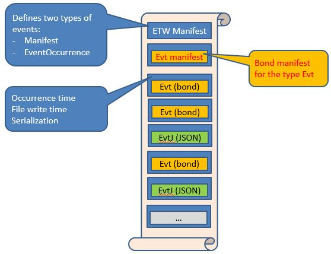

# Bond-in-ETW

All other Tx samples show how to use LINQ on existing log/trace formats, by only implementing reading, parsing and queries.

This set of samples illustrates something else - using  ETW as efficient mechanism to write and read events of various serialization formats in the same file:

This file is written by using [EventSource](http://blogs.msdn.com/b/vancem/archive/2012/07/09/logging-your-own-etw-events-in-c-system-diagnostics-tracing-eventsource.aspx), so the first event in the file will be XML manifest as per the ETW standards, which defines two event types:

* Manifest, used to encapsulate manifests of higher-level protocol, such as [Bond](https://github.com/Microsoft/bond) 
* Event Occurrence record, which is instance of [BinaryEnvelope](../../Source/Tx.Bond/BinaryEnvelope.cs) and contains serialized event payload.

To look at the raw content of file like this, use the [Tx driver for LINQPad](../../Source/Tx.LinqPad/Readme.md) to create connection to tx\Traces\BondEtwSample.etl

## Samples

* Bond only [write and read API](API/Readme.md)