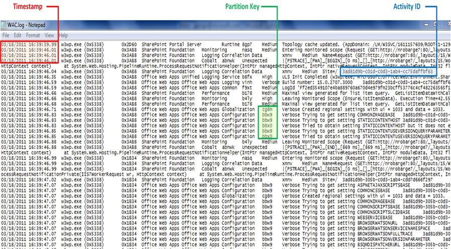

# Extending Tx with semi-structured text logs

In this sample we are showing how to extend Tx to parse semi-structured text logs from in ULS (Unified Logging Service) format. This format is used by the SharePoint family of products.

Here is what these logs look like:

Here:

* The first few columns are structured data like timestamp and process name(id).
	* Conceptually this is very similar to the ETW system header
	* Field of interest is the Timestamps, that will be needed for merging 

* There is a short identifier of the events type, that can be used as partition key.
	* This is similar to the ETW event id
	* It tells us what will be the format of the text message included in the event

* Most of the data is serialized as a string
	* Conceptually this is similar to the ETW byte[] aray
	* The layout is different for each event type, but the same for event occurrences with the same partition key

Open the solution Samples\Introduction\Extensibility.sln, and look at [Program.cs](Program.cs)

This represents the desired result - being able to use Playback on ULS files. Once you do this you can also do queries across ULS and any other formats supported by Tx.

## Implementing raw parser

The first step is to represent the events in their raw form as C# instances. 
This is achieved in a trivial way by:

* defining the raw format as [Ulsrecord](UlsRecord.cs)
* building a [parser](UlsEnumerable.cs) as IEnumerable&lt;UlsRecord&gt;

The next small step is flipping this to [Observable](UlsObservable.cs)

If you are not interested in queries across heterogeneous format, you should probably stop here and not take dependency on Tx. 

The rest is extra work that will give you two features:

* statically typed classes allowing IntelliSense and compile validation when people build queries
* capability to sort events across formats - e.g. here ULS from SharePoint and ETW events from IIS

## Implementing Attributes

Just like in ETW, we generated types, here we want to define attributes that define the mapping between raw data (the message that came in the event) and types that expose the fields in C# friendly way.

Here the [UlsAttribute](UlsAttributes.cs) has two properties:

* EventId that is used as partition key
* RegEx, which is regular expression used to parse the string

!! Defining structured classes

In this example, we manually defined statically typed classes like this:

    [UlsEvent("nasq", "^Entering monitored scope \\((.*)\\)$")]
    public class EnteringMonitoredScope
    {
        public string Scope;
    }

    [UlsEvent("b4ly", "^Leaving Monitored Scope \\((.*)\\). Execution Time=(.*)$")]
    public class LeavingMonitoredScope
    {
        public string Scope;
        public double ExecutionTime;
    }

Of course, these classes can also be generated:

* by finding the printf statements in the original code, like WPP (Windows Trace Pre-Processor) is doing.
* by analysis of what parts of the string are repeating

## Implementing TypeMap

The first choice here is which I*TypeMap interface to use:

* Use ITypeMap if implementing plain transformation (all output events have the same type)
* Use IRootTypeMap when implementing base class representing multiple possible partitioning mechanisms
** Example is how the manifest vs. classic difference in ETW does not impact getting a timestamp from the header nor layout of the binary data (See [EtwTypeMap](../../../Source/Tx.Windows/EtwNative/EtwTypeMap.cs)
* Use IPartitionableTypeMap when:
** the input is multiplexed sequence of many types of event, that can be distinguished by some partition key
** the schema for any two occurrences of events with the same key is the same
** the output will be multiplexed sequence of many types (they must inherit from common base class)

In this case, we go with the first option.

One tricky part here is how to construct lambda expressions from attributes.

What helps is manually writing few specific expressions manually like the commented code in [UlsTypeMap](UlsTypeMap.cs). Then, look at them in the debugger, to see what the expressions should look like.

## Implementing Playback Extension Methods

The final step is implementing extension methods, like in [UlsExtensions.cs](UlsExtensions.cs)

This method instructs Playback and TypeOccurenceStatistics how to create the raw reader for your type of files, and makes it aware about the available type maps. 