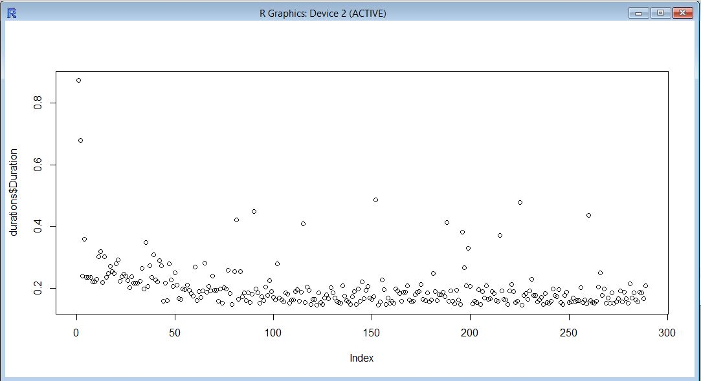
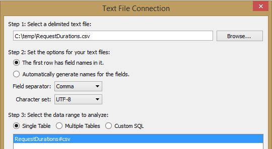
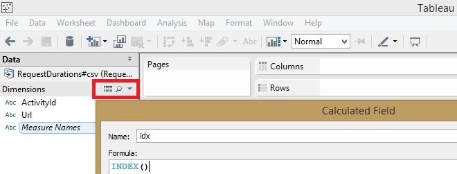
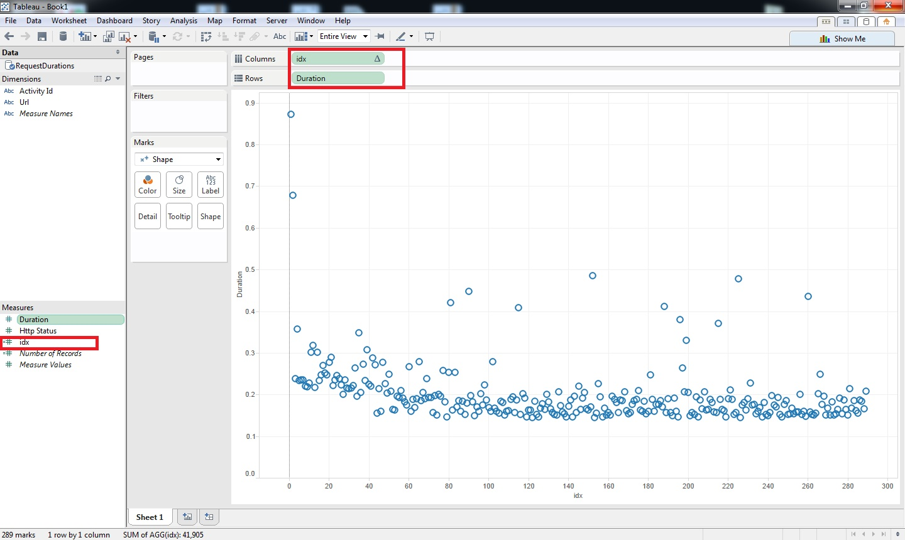

# Exporting results to .csv file
The single-pass feature of Tx allows to perform LINQ query and feed the output directly to standard .csv file. 

This can be useful to integrate with existing popular UI-s for data exploration such as Excel, R and Tableau. 

## Excel

To visualize the request duration as scatter-plot in Excel: 

- select the Duration column
- choose the INSERT on the ribbon, and then Recommended Charts
- choose Scatter

## R

To visualize the same events in R, we start from this  useful [introduction](http://www.cyclismo.org/tutorial/R/input.html#read)  

    > durations = read.csv("C:\\temp\\RequestDurations.csv", header = TRUE)

This reads the file into the variable dat. R provides out-of-box means to inspect data:
 
    > summary(durations)
                                    ActivityId                                  Url        HttpStatus     Duration     
     80000146-0000-fe00-b63f-84710c7967bb:  1    http://georgis2:80/helloworld.htm:283   Min.   :304   Min.   :0.1452  
     80000147-0000-fe00-b63f-84710c7967bb:  1    http://georgis2:80/windir.txt    :  6   1st Qu.:304   1st Qu.:0.1600  
     80000148-0000-fe00-b63f-84710c7967bb:  1                                            Median :304   Median :0.1837  
     80000149-0000-fe00-b63f-84710c7967bb:  1                                            Mean   :304   Mean   :0.2007  
     8000014a-0000-fe00-b63f-84710c7967bb:  1                                            3rd Qu.:304   3rd Qu.:0.2089  
     8000014b-0000-fe00-b63f-84710c7967bb:  1                                            Max.   :304   Max.   :0.8739  
     (Other)  

To confirm raw values are the same as in LINQPad we could do:

    > durations$Duration
   
 And to get a chart we do:
 
    > plot(durations$Duration)

## Tableau

In [Tableau](http://www.tableausoftware.com/):

* Click Open Data
* Create connection to the file

* For X axis, create a calculated field as INDEX()

* In the Analysis menu disable the "Aggregate Measures" option 
* Drag Duration to Rows
* Drag the index to Columns

