# HTTP Samples

These samples are using a trace from HTTP.sys - the kernel component of Microsoft's web server "Internet Information Services" (IIS):

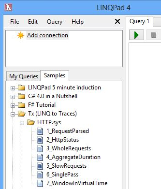

Here IIS was used to serve two pieces of static content:

- helloworld.htm - a small HTML file
- windir.txt - big text file
The following is a quick walk through of the samples:

## Begin Request

When IIS receives new http request, it traces event of type Parse (id=2). This event contains the requested Url. Each request has also an ActivityId - a special identifier that has the same value for all events belonging to the same request.

With the query [BeginRequest](BeginRequest.linq), we display just the Url and the Activity Id:

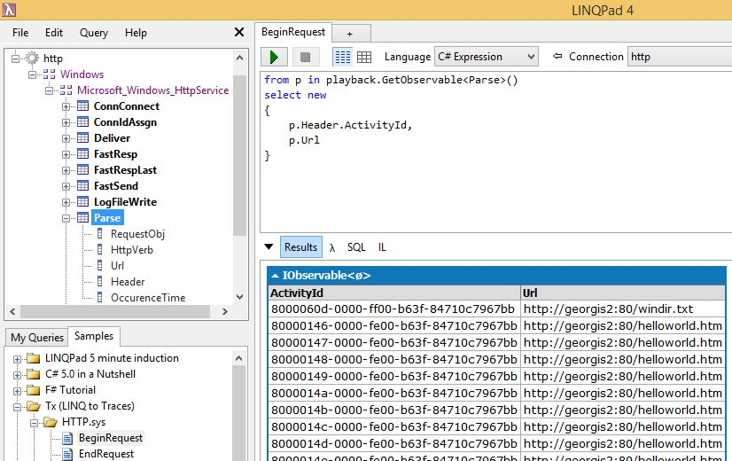

Note here that if we drag-drop "Parse" from the tree, it shows with long namespace name. 

To make it as simple as "Parse" we used LINQPad's feature to add namespaces 

* Press F4, "Additional Namespace imports" 
* Or select Query->QueryProperties from the menus

## End Request

When IIS parsed incoming request as above, it did not know the outcome yet. The status becomes clear from subsequent event, which we get with the [EndRequest](EndRequest.linq) query:

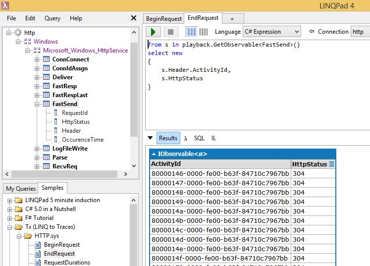

Note here:

* Status 304 means "not modified", which is success code for retrieving static content
* Events have the same ActivityID-s, so they can be correlated to the start events

## Request Duration

The query [RequestDuration](RequestDuration.linq) correlates the start and end events:

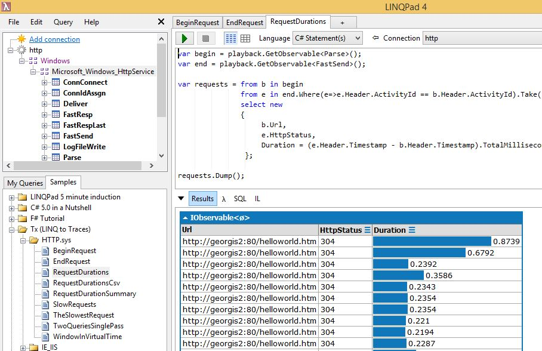

Here:

* we give short names to the begin and end streams (note the Language is now "C# statements")
* for each begin event we want one end event, correlated on ActivityID
* once this event arrives, we want to produce event at output and discard all the memory state we are keeping

This query is example of LINQ statement that will work on infinitely large file. The reason is that we don't keep **all the events** in-memory. We only keep begin events for which we have not seen the end yet. 

If for example IIS handled 1000 requests per second, and requests usually finish within 10 ms, then we will keep just 10 events of type Parse.

See also the virtual time query at the end.

## Exporting the request duration results to .csv file

To visualize the request duration as scatter-plot, the query [RequestDurationCsv](RequestDurationCsv.linq) exports the results into .csv file:

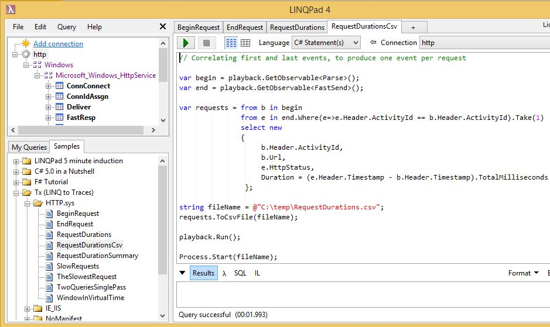

Note the difference between what is happening here and exporting from LINQPad's results:

- to see results, it is usually best to keep them under 1000 lines (default for LINQPAd). All the events must fit in-memory
- Here all events are are streamed into .csv file. Since they are not kept in-memory, this will work regardless of the size of .etl file. The disadvantage of this method is that there is nothing to see in LINQPad.

Exporting to .csv is how Tx can be used in conjunction with tools like Excel, Tableau and R. 

In Excel for example:

- select the Duration column
- choose the INSERT on the ribbon, and then Recommended Charts
- choose Scatter

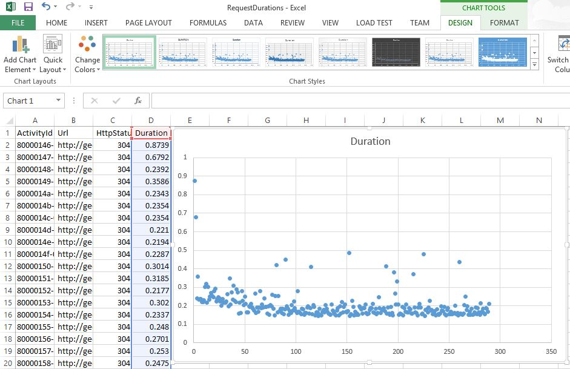

## Request Duration Summary

In the query [RequestDurationSummary](RequestDurationSummary.linq) we show how Rx can be used for aggregation:

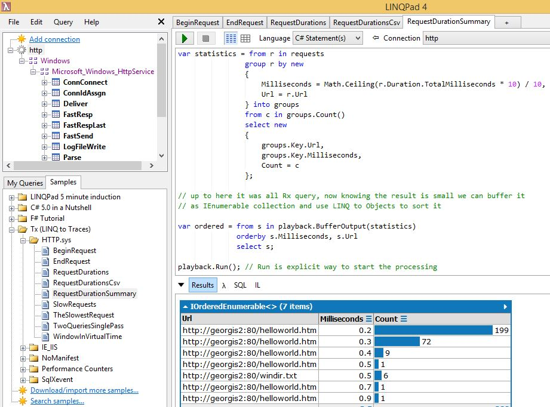

Here we start from the output of the previous query, and group events by Url and the duration rounded in buckets of 0.1 milliseconds. 

Here "statistics" represents a stream of aggregated buckets. By doing playback.BufferOutput(statistics) we wait till the end of the processing and maintain the result in small in-memory list. As we can see here are just 7 items.

The statement "orderby s.Milliseconds, s.Url select s" is using LINQ to Objects to sort this small data set.

Finally, clicking on the icon in the Count column title expands the histogram to the right.

## Slow Requests

From the previous histogram we can tell that there are two cases in which the small file helloworld.htm was retrieved slower than the big .txt file. The query [SlowRequests](SlowRequests.linq) shows how find these requests:

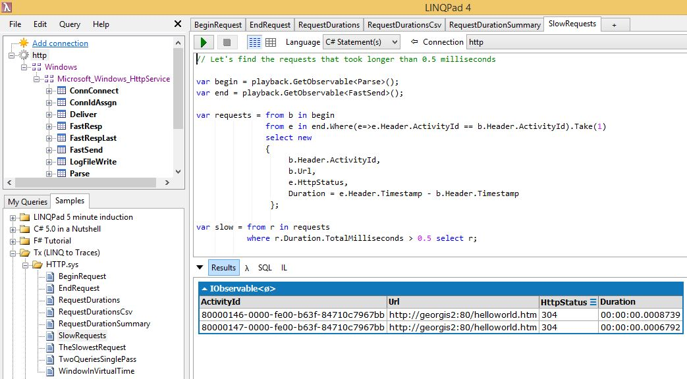

This got us the answer, but at the expense of another read of the file.

## Two Queries on single-pass read

The "query" [TwoQueriesSinglePass](TwoQueriesSinglePass.linq) shows how to answer both queries on one single read of the file:

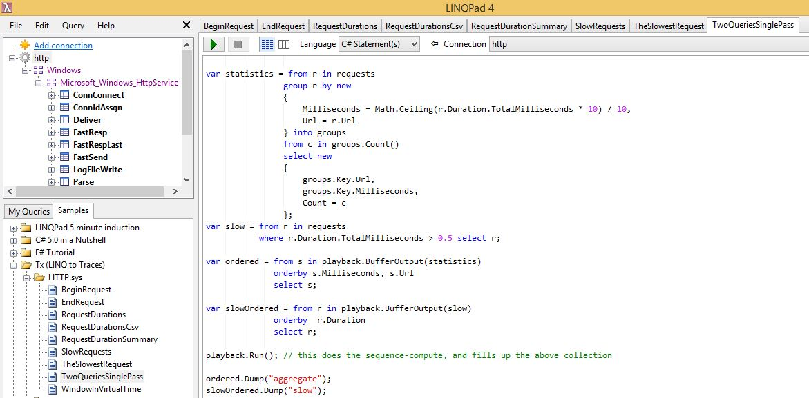

Note here:

* doing Publish() returns IConnectableObservable. This is the Rx primitive for forking the stream.
* doing requests.Connect() is necessary to enable the event flow.
* playback.BufferAllOutput is safe, because we know the output is small

Here is the output:

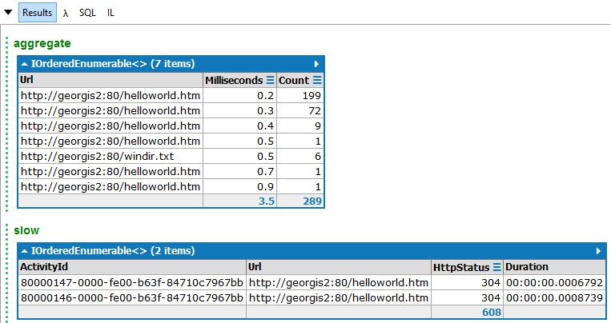

## Virtual Time

Finally, all the queries so far were about the *whole* file. But what if we want to do temporal query? 

The query [WindowInVirtualTime](WindowInVirtualTime.linq) aggregates the events in 5 sec windows as per *virtual time* obtained from the event time-stamps:

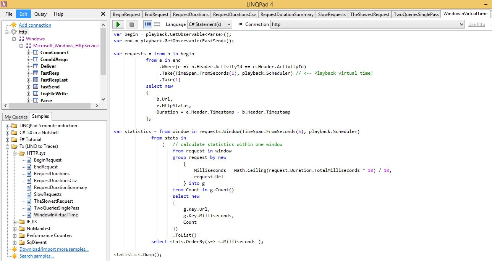

Unlike the previous summary that was for the entire file, this query produces summary list each 5 second as of virtual-time per event time-stamps:

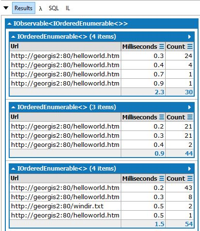

For more about virtual time see:

- [Playback features]( ../../../../Doc/PlaybackFeatures.md)
- [Time Source]( ../../../../Doc/TimeSource.md)

