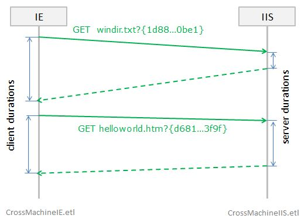
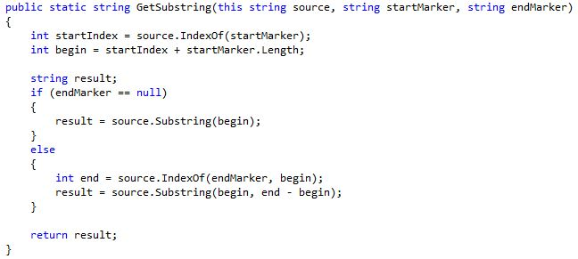
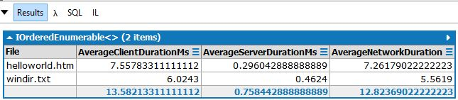

# Cross-Machine and Cross-Provider queries

In this sample we are showing a "connection" to two trace files:

* Internet Explorer (IE) trace from client machine
* Internet Information Services (IIS) trace from the server

## Scenario:
This picture illustrates the protocol:

Here IE sends a request for static content windir.txt, and then another request for helloworld.htm.

To ensure we can correlate the events, the url contains a query string, which is unique Guid. 
Both the server and IE will ignore this, but they will also trace it into ETW.

We are now going to use queries to calculate the client and server durations.

## Client Duration
First, we want to look at the raw trace from the WININET, which is the lowest network layer of IE. ([1_ClientTrace.linq](1_ClientTrace.linq))

After looking at this, we can find the events of interest:

* WININET_REQUEST_HEADER_Info_210  
* WININET_HTTP_RESPONSE_Stop_203

One small trick is that the correlation key is not available as field of the event. Instead it is sub-token of the request string. 

This can be handled in trivial way by extension method like this:

This shows how to turn unstructured data (text) to structured.
Obviously you can implement your own methods like this.

Now, we can formulate next query ([2_ClientDurations.linq](2_ClientDurations.linq)) that calculates the duration.

## Server Durations
Similarly we can do a query ([3_ServerTrace.linq](3_ServerTrace.linq)) that returns the raw server trace.

Here Parse and FastSend are events we are familiar with, from the [HTTP samples ](../HTTP.sys/Readme.md) and the correlation token is extracted the same way as above.

It appears that in some cases, the requests go in some different route and end with the SendComplete event instead. We can use the Rx operator Merge to treat FastSend and SendComplete the same way.

Here is the server duration query ([4_ServerDurations.linq](4_ServerDurations.linq))

## Average Durations
The technique shown so far illustrates how to progressively build more and more complex query. It is usually good idea to test each fragment, and make sure it produces the correct result.

Now we can put all the fragments into one query ([5_AverageDurations.linq](5_AverageDurations.linq)) 

This calculates average client and server durations.
Even though these durations were measured according to different clocks, it is safe to subtract them.

This is because:

* The traces were taken using the high-performance clock (default for ETW)
* Although the clock offset might be different, it cancels out when we compute duration
* The whole experiment was short enough to ignore drift

Here the conclusion is that most of the time is spent on the network, rather than in the server request processing.