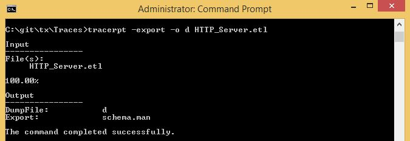
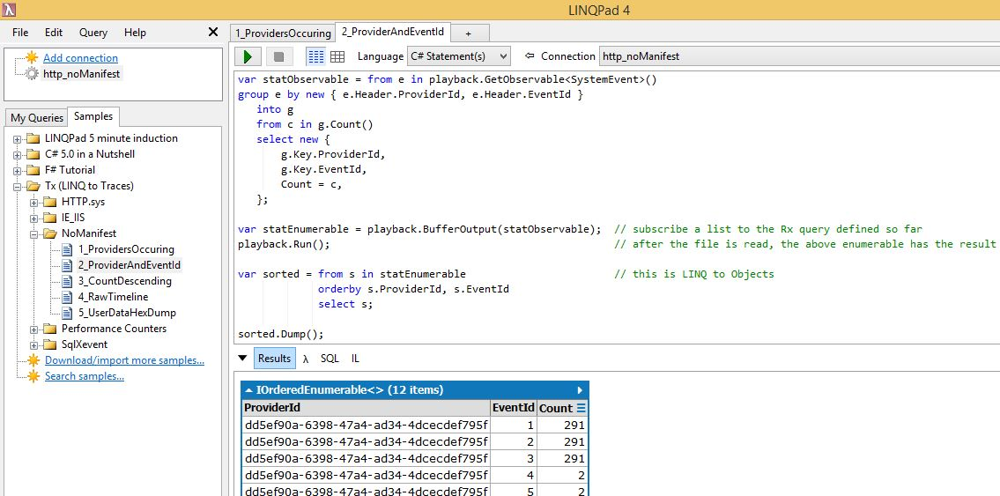
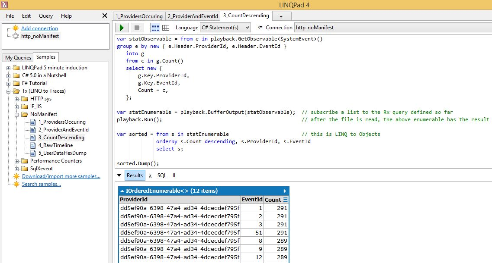
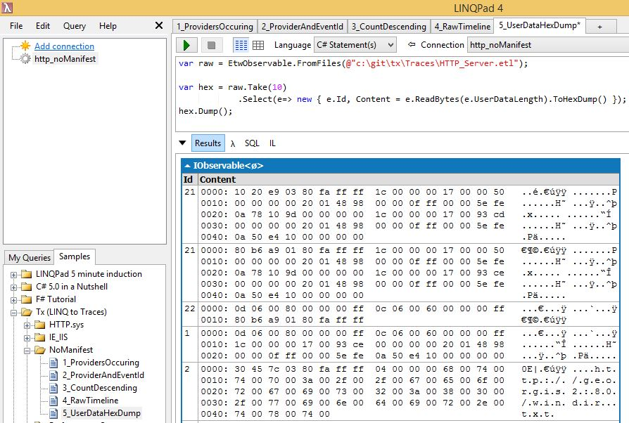

# No Manifest samples

These samples show how to use Tx in LinqPad to read ETW traces without manifest. In this mode, the functionality is limited:

- No tree of types on left
- Access only to the system header (no translation of UserData to C# objects)
- Limited access to the UserData as byte[] or hex dump

Before resorting to this, it is best to try exporting the manifest:

This attempts to read WMI and exports the manifest for all providers that occur in the etl file into schema.man. It is good idea to look at this with notepad to see if the export was successful. 

The export should be done only on machine with the same exact version of the product that installed manifests with WMI.

Assuming the above did not work, we can try using the limited functionality of Tx without manifests.

## Providers occurring in the .etl file

Here is how to see which providers were traced:

To have the No-Manifest samples run out-of-box, they start with the same file 
used by the HTTP.sys samples. 

To run the [query](1_ProvidersOccuring.linq) on your .etl files:

- create new connection to your files using using Tx
- change the "Connection" drop-down to the above

## Statistics of providers and eventID-s

To get statistics per provider and event ID, do this [query](2_ProviderAndEventId.linq):

Here:

- the first part is Rx query that counts the events in incremental fashion and produces one sample per { provider, eventId } at the end of processing
- knowing that the event types are few, we use playback.BufferOutput to accumulate them in IEnumerable collection
- then we sort the collection with LINQ-to-Objects

In this case, we are sorting by eventId

## Statistics sorted on occurrence count

Also very common question is "which events occur most often?". This is answered with the following [query](3_CountDescending.linq):

## Time-line of events 

Although we can't format events as text, we can at least see some of the data that is in the system header. This [query](4_RawTimeline.linq) shows how to look at the raw data of the first 5 events:

## Hex dump of the user data

To look at raw event data, Tx.Core has an extension method string `ToDump(this byte[])`, which can be used on the UserData or any binary payload of structured events.

Unfortunately, the events at the level of playback no longer contain the byte arrays - they are just C# objects on the heap. To get access to the raw data we can use [EtwObservable.cs](../../../Source/Tx.Windows/EtwNative/EtwObservable.cs), which belongs to lower layer of Tx.

Here is example [query](5_UserDataHexDump.linq)

Here the layout is distorted a bit by the default font used in LinqPad. To read the data in Notepad, instead of .Dump() you can do:

        hex.ToCsvFile(@"c:\Repro\hex.csv");
        playback.Run();
        
This will produce no output in LinqPad, and will export the data to the .csv file. Note that:

- when using LinqPad, it is best to do .Take and .Skip to keep the output under say 1000 lines
- The .ToCsvFile extension can be used to export the data in streaming fashion regardless of the file size