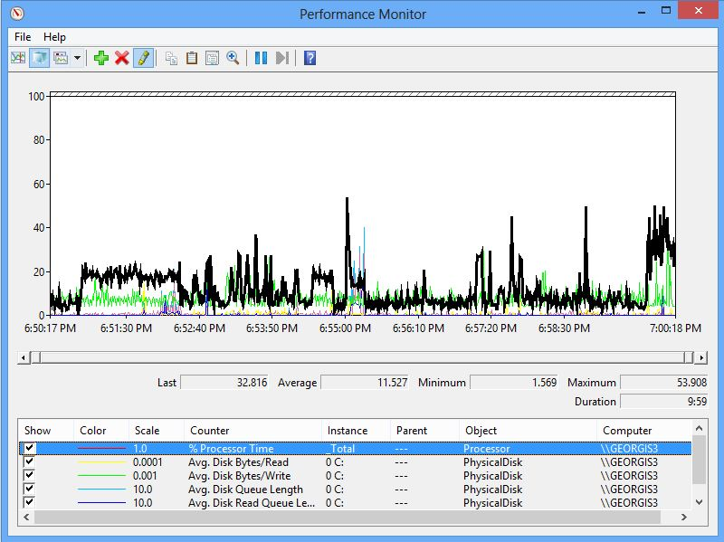
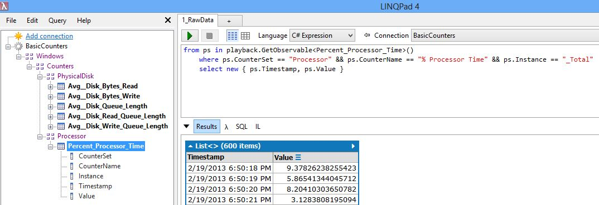
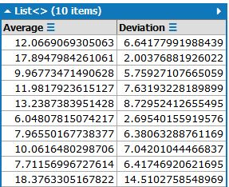

# Performance Counter Samples

For these samples we will illustrate opening .blg (binary log file), which was created from PerfMon.

Binary log is the default format for performance counter recording, and has two advantages compared to .csv (comma separated) and .tsv (tab-separated) files:
* When tracing to .csv instances (e.g. Processes) are enumerated once. New instances that appear during the recording are not picked up
* the binary files are more compact when the trace is huge

Here is what this .blg file looks in PerfMon:

Now we are going to access the same data with LINQPad queries, directly from the .blg file.

## Raw Data

When connecting to .blg files, you don't need to worry about Manifests (the .blg format contains the metadata). This shows as tree on the left. Hover with the mouse to see the occurrence count and further details.

Then, the following query shows the raw data for the CPU:

## Average and Deviation

Frequently, we want to smoothen the trend of performance counters, but not lose the information about the level of noise. Here is a query that computes both the average and the standard deviation:

The output of this query looks like this:

