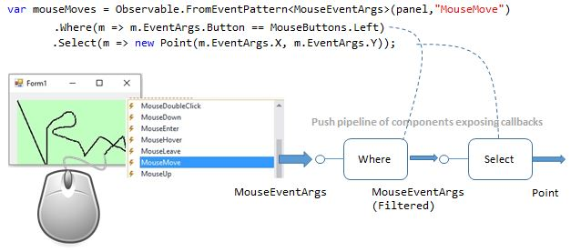

# Mouse move sample

When people hear LINQ they often assume the events are stored (In-memory?, Database?, XML-s?, etc.) before they are queried.

In contrast, the primary usage of Reactive Extensions is on real-time events, without any storage involved. In this sample we are hooking to mouse move events and building a pipeline of callbacks:

Here:
- The **".Where"** represents a callback which simply returns without invoking the rest of the pipeline unless the left button is down. Only if the button is down, the rest is invoked.
- The **".Select"** is callback that transforms the class MouseMoveEventArgs into simple Point that knows X and Y ignoring all other information (e.g. button state) from the original event.

The latency of using Reactive Extension is **microseconds**, which is colloquially refereed to as "Real-Time". 

In this sample the response time is limited by how often the mouse produces events which is about 160 events per second. This is far from the Rx limit of 10 million events per second in single core.

To introduce extra delay of 100 milliseconds, you can comment out the  line

	.Sample(TimeSpan.FromMilliseconds(100))

in [Form1.cs](Form1.cs). Now drawing becomes more raged if you move the mouse fast.

Good book for using Rx in user interfaces like WPF is ["Programming Reactive Extensions and LINQ"](http://www.apress.com/9781430237471)
