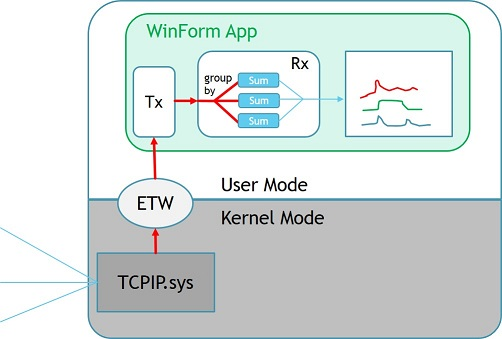
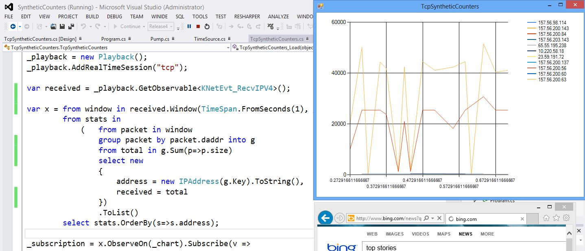
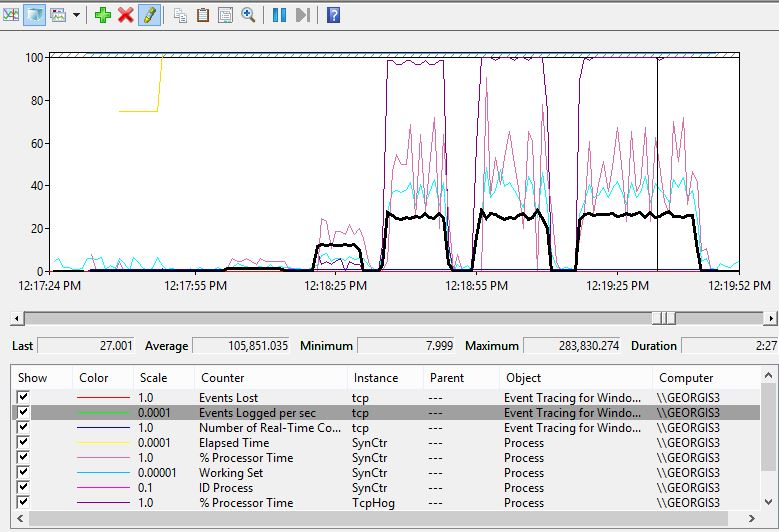

# Synthetic Performance Counters

This sample illustrates how to use ETW events to produce "synthetic performance counters" defined as Rx queries:

Here:

- The machine receives network traffic over TCP
- The transport driver TCPIP.sys traces events into ETW
- Tx copies each event into C# object, and pushes it into IObserver
- Rx query is used to aggregate the total bytes received per second, per IP adress
 
## Running the demo
The demo is WinForms application that uses Tx and Rx. It is only intended to show the concepts, not to measure performance. 

Here is how to run it: 

* in the Properties of the [IE Automation](IEAutomation/Program.cs) project, enter list of url-s., For example: http://bing.com/maps http://bing.com/news
* start [DemoUI](DemoUI/TcpSyntheticCounters.cs), and wait a while to see if there is traffic when the machine is idle
* start IEAutomation

A screenshot looks like this:

Here the top right is the experience of counters - per each IP address we see the trend of bytes received, aggregated over 1 sec window. 

## Performance Test

To test performance, we have to avoid CPU-heavy work like drawing UI and running web browsers. More isolated experiment is using console apps:

* Start [SynCtr](SynCtr/Program.cs)
* Start [TcpHog](TcpHog/Program.cs)
* Open PerfMon and add counters like in the picture below

TcpHog works by sending/receiving a burst of TCP traffic and then waiting for a while. You can interactively control the bursts and the wait time.

Here is example trend of events logged per second:

To do experiment like this on your machine do the following in PerfMon:

* Expand the node "Data Collector Sets" in the left tree
* Right click on User Defined, New, Data Collector Set
* Chose "Create From Template" and browse to [SynCtrDCS.xml](SynCtr/SynCtrDCS)
* Start the collector, do some experiments and then stop it
* Click on the little box (second icon in the menu) and browse for the .blg files that was created

## Benefits of "synthetic" counters

The benefits of this approach compared to real performance counters (the one you see in PerfMon) are:

- The "names" of the counters can be derived from the event payload
- There are no string restrictions like 128 characters, and symbols that are invalid
- Counters are not restricted to one-dimensional hierarchy
- xcopy deployment: no need for creation of counter categories (.Net) or deploying counter manifests via [lodctr.exe](http://technet.microsoft.com/en-us/library/bb490926.aspx). No registry changes etc. 

