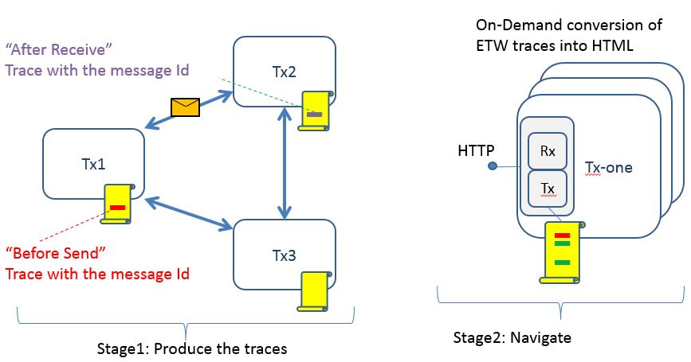
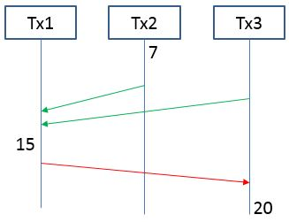
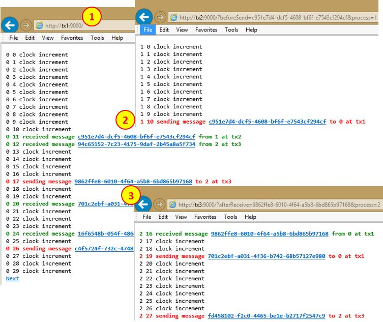

# Causality Navigation

"Causality Navigation" stands for troubleshooting mechanism that works at infinite scale. It allows the user to follow the order of events,  **without using any concept of Time**.

It is based on two assumptions:

* The occurrence order is preserved when events are written to disk (default for ETW)
* Exchanging Correlation Tokens - globally unique ID-s that are known on both end of the wire

Here are the two stages of the sample:

On the left we have a simple console app ["BounceMessages"](../BounceMessages/Program.cs) which runs on three machines. Each instance uses random generator to choose when to send message to some other machine. 

Before sending the message it:

* generates unique ID (correlation token)
* traces the fact that the message is being send

Each instance also:

* listens for messages
* traces the fact message was received including the correlation token. 

One particular time-line of message exchanges can be:

Here each process keeps its own event counter. Event 7 on Tx2 might influence event 15 on Tx1, which in turn might influence event 20 on Tx3. This is the meaning of "causality order" A>B if B can influence A. 

Instead, we go to the stage 2 in the first picture. Here another console app ["CausalityNavigation"](Program.cs) listens to HTTP and does on-demand queries on the local ETW trace.

Here is the UI Experience:

At the beginning we point the browser to Tx1, and it shows the first 30 events

* By clicking Next, Next, ... Previous we can navigate along the line for Tx1. 
* By clicking on green hyperlinks, we move back in time (see the time-line picture)
* By clicking on red hyperlinks we move forward to events that could be influenced by the current event.

To run the sample locally:

* Rebuild the solution in Samples\TimeAndOrder
* Run the script [RunCausalityNavigation.cmd](RunCausalityNavigation.cmd) on each machine

To run on multiple machines:

* Edit the file [Endpoints.txt](../BounceMessages/EndPoints.txt) with your machines
* Copy the binaries on each machine
* Run the script [RunCausalityNavigation.cmd](RunCausalityNavigation.cmd) on each machine

For more about the theory about "causality order", useful materials are: 

* [Lamport's paper](http://research.microsoft.com/en-us/um/people/lamport/pubs/time-clocks.pdf) in which he constructs clock that does not contradict the causality order. Note we are not implementing Lamport Clock in this sample. We are only navigating "Processes" and "Messages". Our time-line drawing is flipped vertically but is otherwise isomorphic to his.
* The concept of [Light Cone](http://en.wikipedia.org/wiki/Light_cone) from theory of relativity. Interestingly, due to packet buffering similar phenomena occur in computer networks in plain Newtonian space-time.