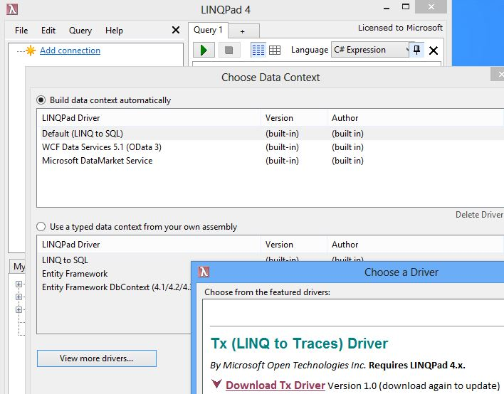
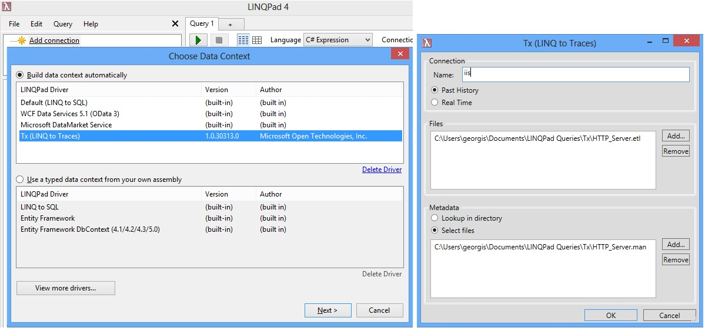
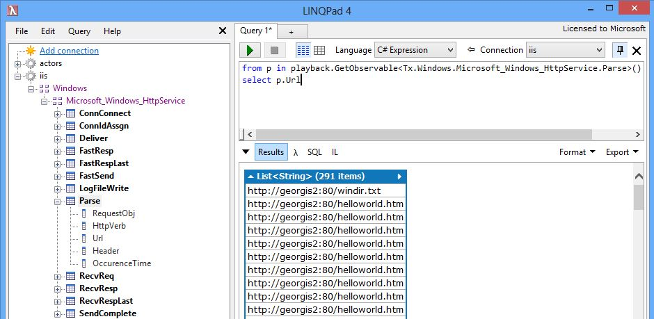
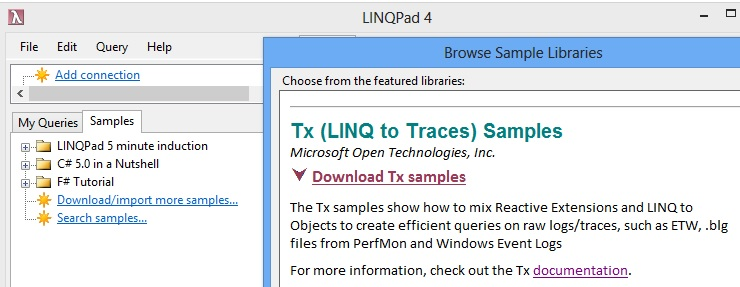

# LINQPad driver for Tx

First, install [LINQPad](http://www.linqpad.net). This is the best education tool about LINQ, Regular Expressions, ... and all cutting edge features in C#

Click on Add Connection and then "View More Drivers":

Click on the Download link, and then select the driver from the list:

On the next page you have a choice between past or real-time sessions.
As of now the LINQPad driver supports only ETW, so past means .etl files and real time is ETW sessions.

As general rule, it is best to first try your queries on past history.
This way you can try the query many times on the same data to make sure you get the desired results. 

* Click Add... for "Files" and browse for Documents\LINQPad Queries\Tx\HTTP_Server.etl
* Click Add... for "Metadata" and add HTTP_Server.man
This .etl file and manifest are from IIS (Internet Information Services) and come as samples with Tx. 

Choose connection name and click OK

On the left tree you now see the schema of the events
* In the query window, type "from p in "
* Drag the Parse node from the left tree.
* Complete the query with "select p.Url" and press the green button

It is good idea to also install the Tx samples, and try them:

Click on the Samples tab, "Download more samples":

## See also:
* [Playback conceptual model](../../Doc/PlaybackConcepts.md)
* [Queries on trace from HTTP.sys](../../Samples/LinqPad/Queries/HTTP.sys/Readme.md): the kernel driver used by IIS (Internet Information Services)
* [Average and Deviation](../../Samples/LinqPad/Queries/Performance%20Counters/Readme.md). This query is based on "Binary Log" (.blg) file which is the default output of PerfMon for counters
* [Cross/provider & cross machine queries](../../Samples/LinqPad/Queries/IE_IIS/Readme.md). Response time of IE on client machine and IIS on server.

